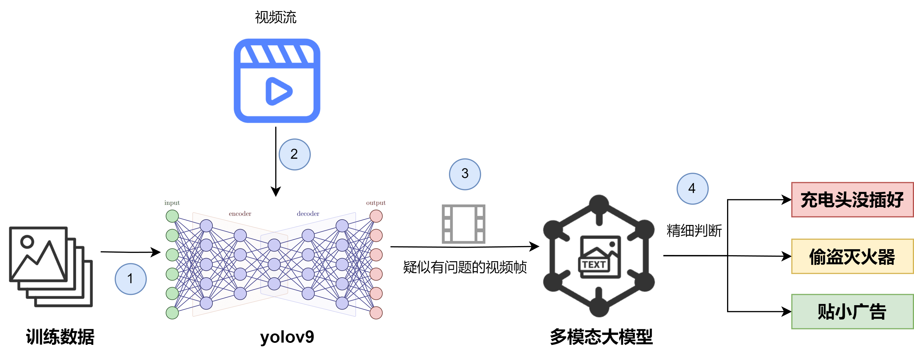
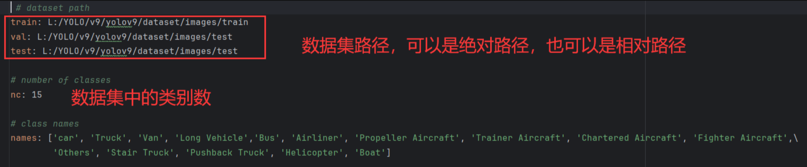
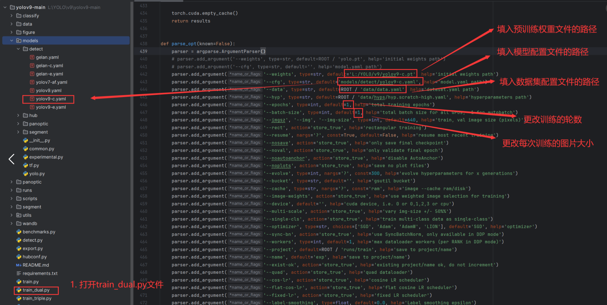
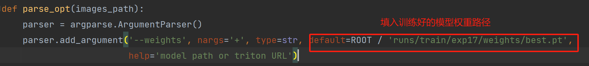
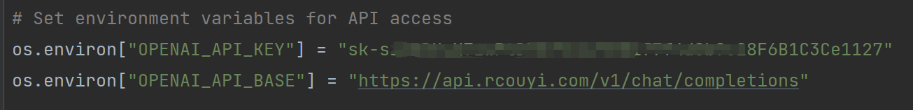
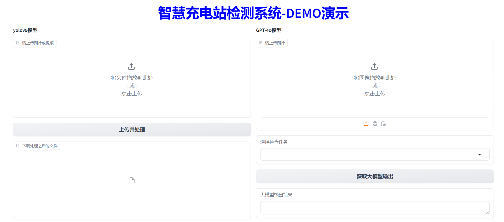
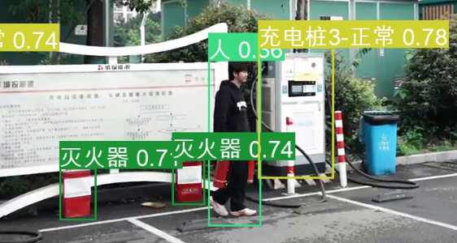
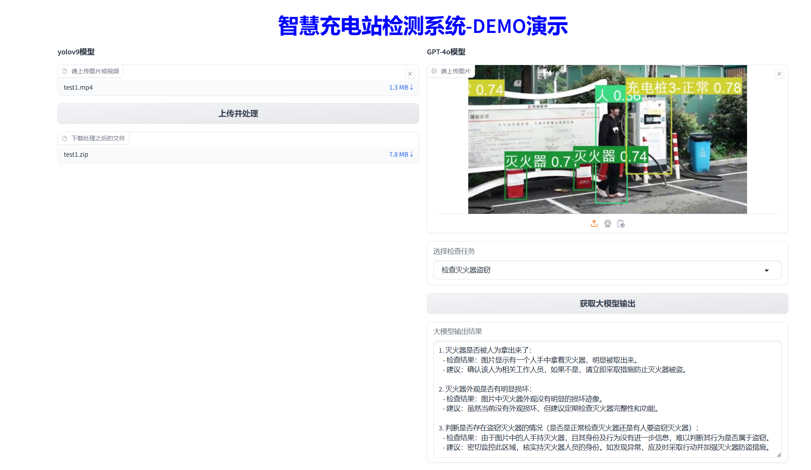

# Charging_Station_ Detection

## 介绍
该项目利用yolov9以及多模态大模搭建了一个充电站智能检测系统，基于充电站内视频监控的实时视频流，检测充电头是否插好、是否有人偷盗灭火器以及贴小广告。

## 项目框架


## 工作流程
1. 基于标注好的训练数据，微调预训练好的yolov9模型。<br>
2. 将停车场内的视频流传入到微调好的yolo模型。<br>
3. yolo模型会初步进行检测，并将可能有问题的视频帧保存为图片，传送给多模态大模型。<br>
4. 大模型会对图片进行更加细致的判断，并给出包含更多信息的答案。

## 训练

### 1.  克隆本项目到本地

```
git clone https://gitee.com/haunghn/smart-charging-station.git
```

### 2.  安装第三方库

```
pip install -r requirements.txt
```

### 3. 准备好你的训练数据，数据的格式如下：


```plaintext
dataset/
    ├── image/
    │   ├── test
    │   ├── train
    │   └── val
    └── label/
        ├── test
        ├── train
        └── val
```

### 4. 还需要一个配置文件说明数据集的具体情况


### 5. 根据path，更改下面的配置。你需要下载预训练好的[yolo模型权重](https://github.com/WongKinYiu/yolov9/releases/download/v0.1/yolov9-c.pt)



### 6. 开始训练，运行train_dual.py

## 目标检测推理
### 1. 首先更改你的权重路径

### 2. 填入openai_key

### 3. 运行 detect_dual_gradio.py

你可以上传要检测的视频，等待模型处理完毕，你可以下载挑选出来的有问题的图片，再传入大模型中进一步检测。
## demo展示



